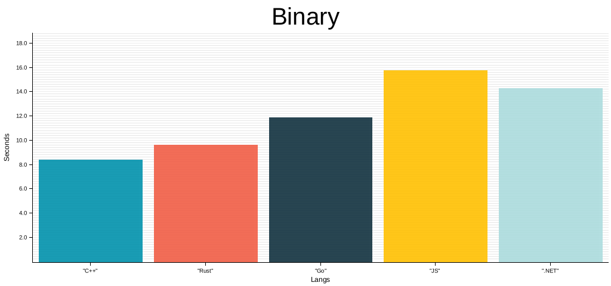
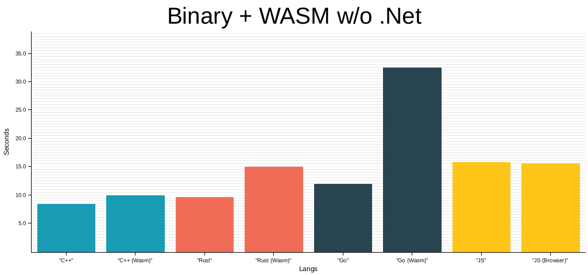
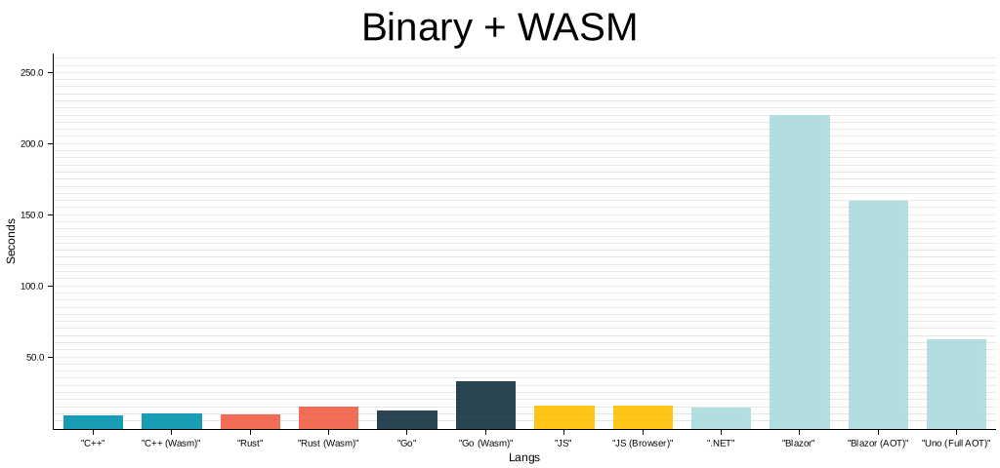

## Intoduction

Solution for [cata](https://www.codewars.com/kata/5a667236145c462103000091) from codewars implemented in different languages.

## Requirements

OS: Linux
Installed developments tools: GCC(11+), Rust (1.5+), Nodejs (14+), Golang, Dotnet (6+), Emscripten (3+), GNU Time, Bash, Make
TDB Docker build 

## Test run results

### Machine/OS parameters:

```
AMD Ryzen 7 3700X 8-Core Processor
32 GB RAM
Gentoo Linux 5.10.76
```

### Compilation

#### C++

Compiler: g++ (Gentoo 11.2.0 p1) 11.2.0

```
g++ -O3 -march=native main.cpp -o $(OUTPUT_BIN)
```

#### Golang
go version: go1.17.5 linux/amd64
```
go build -o $(OUTPUT_BIN) cmd/cli/main.go 
```

#### .NET

.NET version: 6.0.100
```
dotnet publish -c Release -r linux-x64 --self-contained false -o $(OUTPUT_BIN)
```

#### JS
Typescript: 4.5.2

Node version: v14.15.5
```
tsc --outDir ../../bin/nodejs --target es2016 --module none --excludeFiles **/*.test.ts
node bin/nodejs/index-cli.js
```

#### Rust
Rustc version 1.56.1
```
cargo build --release
```
Release profile
```
[profile.release]
codegen-units = 1
panic = "abort"
opt-level = 3
overflow-checks = false
```

### Results


| Lang |Time | Memory | Normal | Average | Bad | Worst | 
| --- | ---- |  ---- |  ---- |  ---- |  ---- |  ---- | 
| C++ | 0:09.00 |4684 |1648/2000 |257/2000 |75/2000 |117080 for 102 |
| Go | 0:12.03 |8340 |1648/2000 |257/2000 |75/2000 |117080 for 102 |
| .NET | 0:14.92 |157264 |1648/2000 |257/2000 |75/2000 |117080 for 102 |
| JS | 0:15.95 |71072 |1648/2000 |250/2000 |82/2000 |117080 for 102 |
| Rust | 0:09.87 |3892 |1648/2000 |257/2000 |75/2000 |117080 for 102 |


- **Time** - Elapsed (wall clock) time (h:mm:ss or m:ss) 
- **Memory** - Maximum resident set size (kbytes) 
- **Normal** - Number of calls to DFS function compared to number of graph nodes (calls<=n) 
- **Average** - Number of calls to DFS function compared to number of graph nodes (n< calls <3n) 
- **Bad** - Number of calls to DFS function compared to number of graph nodes (calls > 3n) 
- **Worst** - The worst number of calls to DFS function and number of graph nodes 

## WASM: Test run results

Results collected by nodejs script which uses puppeteer 

### Machine/OS parameters:

```
AMD Ryzen 7 3700X 8-Core Processor
32 GB RAM
Gentoo Linux 5.10.76
Browser: HeadlessChrome/97.0.4691.0
Puppeteer: 12.0.1
```

### Compilation

#### C++

Compiler: emcc (Emscripten gcc/clang-like replacement + linker emulating GNU ld) 3.0.0

```
emcc -O3 \
	--bind \
	-s ALLOW_MEMORY_GROWTH=1 \
    -s MODULARIZE=1 \
    -s EXPORT_ES6=1 \
	-std=c++20 \
	-o $(OUTPUT_WASM) main_wasm.cpp
```

#### Golang
go version: go1.17.5 linux/amd64
```
GOOS=js GOARCH=wasm go build -o $(OUTPUT_WASM) cmd/wasm/main.go 
```

#### .NET

.NET version: 6.0.100
```
dotnet publish -c Release -property:AOT=True -o $(OUTPUT_WASM) ./SquareSumsWasm/SquareSumsWasm.csproj
dotnet publish -c Release -property:AOT=False -o $(OUTPUT_WASM) ./SquareSumsWasm/SquareSumsWasm.csproj
```

#### JS
Typescript: 4.5.2
```
tsc --target es2016 --module es6 --declaration --outDir ./dist
```

#### Rust
Rustc version 1.56.1
Wasm-pack version 0.10.1
```
wasm-pack build --release --target web --out-dir $(OUTPUT_WASM) rust-wasm
```
Release profile
```
[profile.release]
codegen-units = 1
panic = "abort"
opt-level = 3
overflow-checks = false
[package.metadata.wasm-pack.profile.release]
wasm-opt = ['-O4']
```
### Results

Tested on **HeadlessChrome/97.0.4691.0**


| Lang |Time | Memory | Size | 
| --- | ---- |  ---- |  ---- | 
| C++ (Wasm) | 9.82 |768.00 |237.97 |
| Rust (Wasm) | 14.90 |256.00 |45.76 |
| JS (Browser) | 15.57 |17408.00 |55.15 |
| Go (Wasm) | 32.47 |512.00 |2058.38 |
| Blazor (AOT) | 159.62 |2228.00 |15263.32 |
| Blazor | 219.95 |1676.00 |5146.18 |
- **Time** - Calculation duration measured using browser Performance Api 
- **Memory** - Difference (in Kb) between JSHeapTotalSize before loading script and after calculations run 
- **Size** - Size (in Kb) of files loaded to run calculations 


